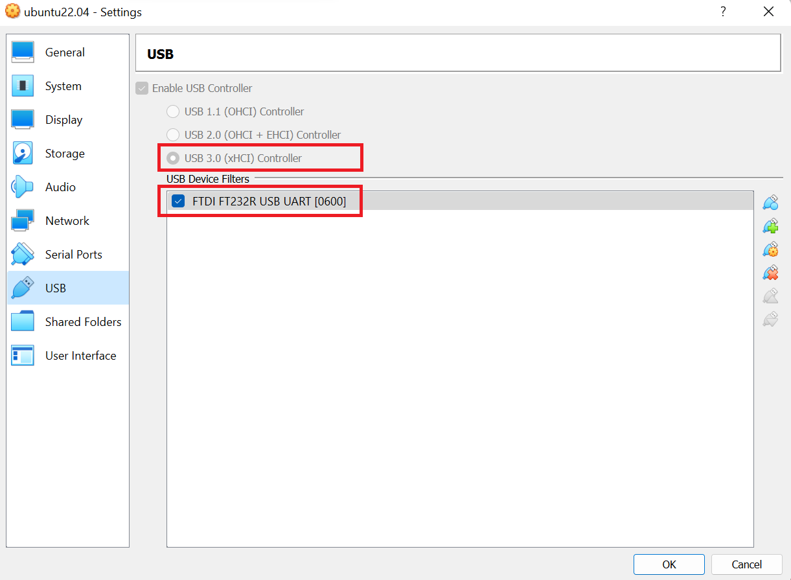

We use a GSP module with serial port, but the computer does not have serial port. We have to use a USB adapter to connect the GSP module and the computer. Then the Ubuntu in the Virtual Box can access the GSP module through a USB port. 


To access serial port through USB port, we have to install an extension for VirtualBox
https://www.techrepublic.com/article/how-to-enable-usb-in-virtualbox/



Then we can access this USB port inside the Ubuntu virtual machine
```
lsusb
```


The serial port is managed as a file in Ubuntu system.
```
ll /dev/ttyUSB0
```

The file /dev/ttyUSB0 belongs to root user and dialout group. 
To access /dev/ttyUSB0, we need to add current user to dialout group. 
```
    sudo usermod -a -G dialout <your-account>
    
    # restart
    ...

    # make sure user is added to group
    groups
```

```
apt install dmesg
dmesg | grep tty
```


Use screen read the input from serial port
```
apt install screen

screen /dev/ttyUSB0

# exit
ctrl+a /
```

